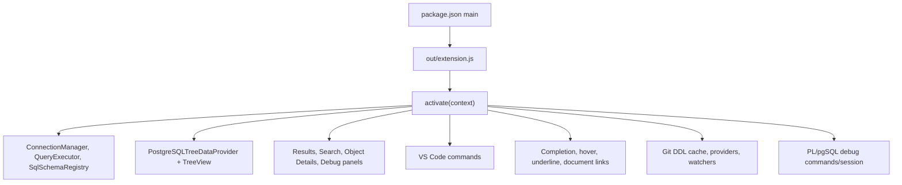
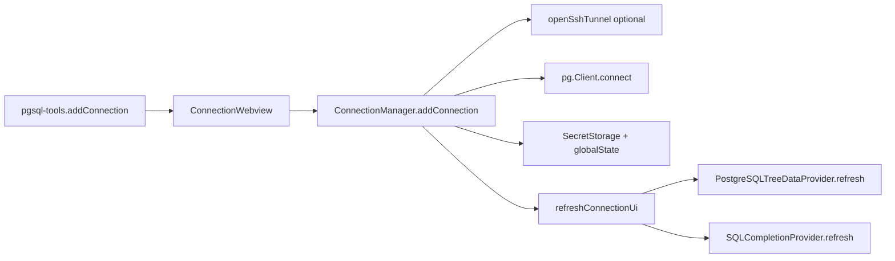
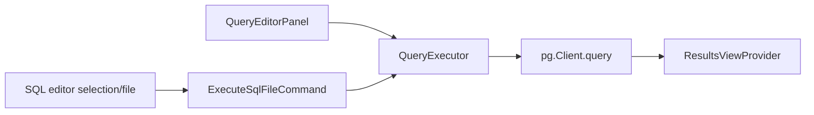
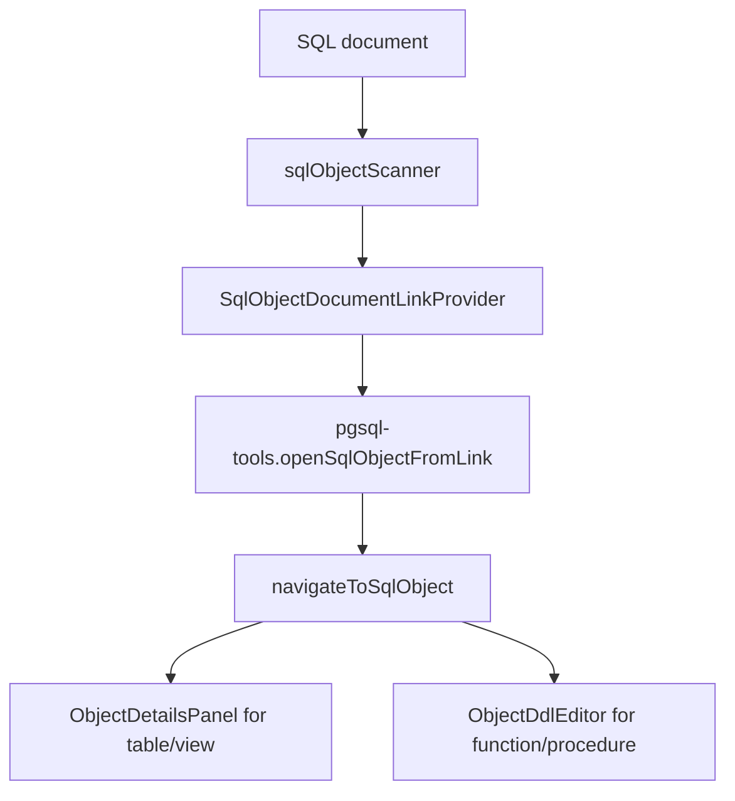
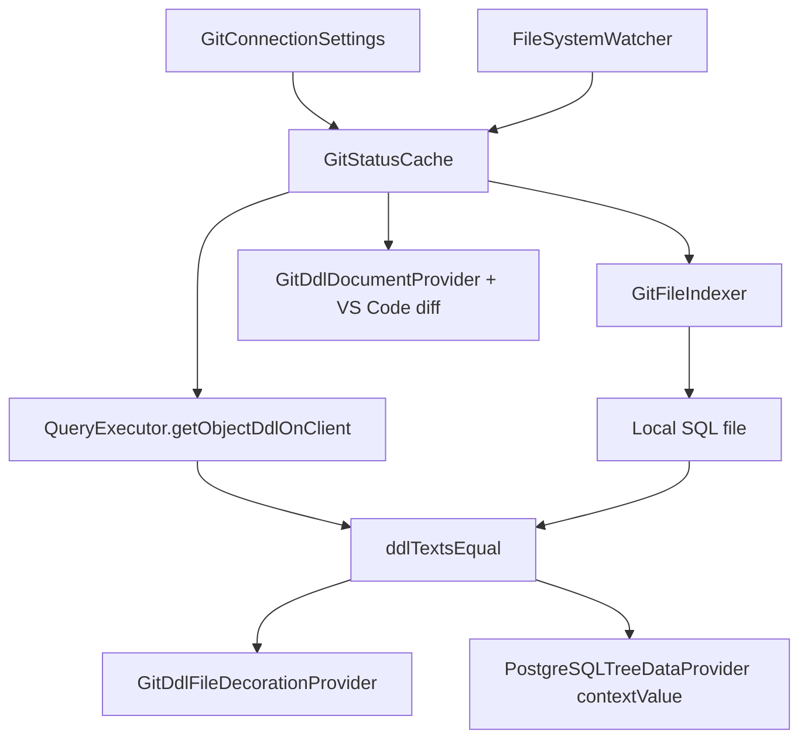
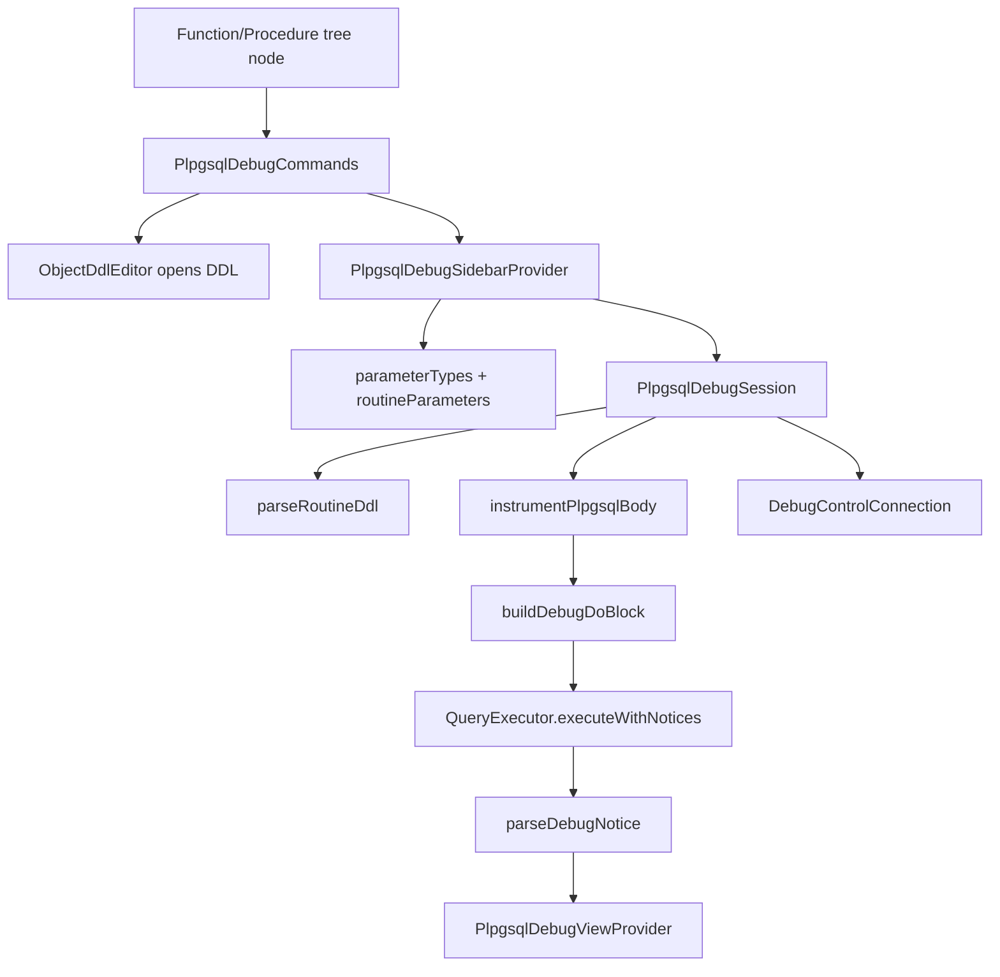

# Подробное описание проекта PostgreSQL Tools

## Назначение

`pgsql-tools` - расширение VS Code для работы с PostgreSQL. Оно добавляет боковую панель с подключениями и объектами БД, выполнение SQL, просмотр результатов, детали объектов, ER-диаграммы, сравнение схем, health-панель, синхронизацию DDL с локальным Git-каталогом, подсветку SQL-объектов и отладку PL/pgSQL без установки `pldebugger` на сервер.

Проект написан на TypeScript. Исходники находятся в `src/`, скомпилированный runtime - в `out/`. Статические файлы webview лежат в `resources/`.

## Точки входа и сборка

| Файл | Роль | Что вызывает / обслуживает |
| --- | --- | --- |
| `package.json` | Манифест VS Code extension. Объявляет `main: ./out/extension.js`, команды, меню, views, keybindings, настройки и цвета. | VS Code читает `contributes`, затем запускает `out/extension.js`. Скрипты `compile`, `watch`, `test`, `lint`, `package` управляют разработкой и сборкой. |
| `tsconfig.json` | Конфигурация TypeScript. | Компилирует `src/` в CommonJS ES2020 в `out/`, генерирует `.d.ts` и source maps. |
| `.vscode/launch.json` | Запуск Extension Development Host. | Перед запуском вызывает default build task и подхватывает `out/**/*.js`. |
| `.vscode/tasks.json` | Build task `npm: compile`. | Используется F5-конфигурацией. |
| `.vscode/settings.json` | Workspace-настройки разработки. | Содержит локальные настройки IDE, например поведение дерева. |
| `README.md` | Пользовательское описание расширения. | Описывает функции, запуск, сборку и базовое использование. |
| `package-lock.json` | Зафиксированные версии npm-зависимостей. | Используется `npm install` для воспроизводимой установки. |
| `.gitignore`, `.vscodeignore` | Исключения для Git и VSIX. | Отделяют исходники, зависимости и артефакты сборки от публикуемого пакета. |

`package.json` объявляет три контейнера UI:

- Activity Bar: `pgsql-tools` с view `pgsqlDatabases` и webview `pgsqlTreeSearch`.
- Panel: `pgsql-tools-panel` с `pgsqlResults` и `pgsqlPlpgsqlDebug`.
- Secondary Sidebar: `pgsql-tools-debug` с `pgsqlPlpgsqlDebugSidebar`.

Основные зависимости:

- `vscode` API - регистрация команд, tree view, webview, language providers, SecretStorage.
- `pg` - подключение и запросы к PostgreSQL.
- `ssh2` - SSH-туннели.
- `@vscode/codicons` - шрифт codicons для webview.

## Поток активации

Главная точка связывания - `src/extension.ts`. Она создает общие singleton-подобные экземпляры, регистрирует команды, webview-провайдеры, tree view, SQL language features, Git DDL watcher и обработчики событий редактора.

## `src/extension.ts`

| Поле | Описание |
| --- | --- |
| Роль | Центральный оркестратор расширения. |
| Экспортирует | `activate(context)`, `deactivate()`. |
| Зависит от | Почти всех подсистем: `database`, `providers`, `commands`, `views`, `language`, `git`, `debug`, `services`, `search`. |
| Вызывается из | VS Code runtime через `main` в `package.json`. |
| Потоки данных | Создает менеджеры, передает зависимости в команды и webview, восстанавливает подключения, обновляет tree/status bar/code lens, связывает DDL editor с debug metadata. |
| Важно | На `deactivate()` закрывает все подключения. При активации не подключается к БД автоматически, а восстанавливает список сохраненных соединений. |

Ключевые действия `activateExtension()`:

1. Создает `ConnectionManager`, `QueryExecutor`, `SqlSchemaRegistry`, `SQLCompletionProvider`.
2. Создает `PostgreSQLTreeDataProvider`, `ResultsViewProvider`, debug webview providers.
3. Создает Git DDL providers/cache/settings и подключает их к дереву.
4. Регистрирует команды через `registerExtensionCommands()`, `registerGitDdlCommands()` и `PlpgsqlDebugCommands.register()`.
5. Создает watcher локальных DDL-файлов Git.
6. Регистрирует webview views: results, trace, debug sidebar, tree search.
7. Регистрирует SQL completion, hover, underline и document links.
8. Создает `TreeView` `pgsqlDatabases` и обрабатывает выбор объектов.
9. Поддерживает status bar и CodeLens активного подключения.

## Каталог `src/database/`

| Файл | Роль | Экспортирует | Зависит от | Вызывается из | Потоки данных и важно |
| --- | --- | --- | --- | --- | --- |
| `src/database/connectionManager.ts` | Управляет подключениями PostgreSQL и сохраненными конфигами. | `ConnectionConfig`, `ConnectionDisplayInfo`, `ConnectionManager`. | `vscode`, `pg`, `openSshTunnel`. | `extension.ts`, `QueryExecutor`, tree/search/views/debug/git commands. | Пароли хранит в `SecretStorage`, конфиги без паролей - в `globalState`. Открывает `pg.Client`, опционально через SSH-туннель. Активное подключение выбирается отдельно от списка сохраненных. |
| `src/database/queryExecutor.ts` | Единая точка выполнения SQL и получения метаданных/DDL. | `QueryResult`, `IndexInfo`, `ForeignKeyInfo`, `ConstraintInfo`, `GitDdlObjectKind`, `RoutineResolveInfo`, `RoutineParameterInfo`, `QueryExecutor`. | `pg`, `ConnectionManager`, `gitRoutineDdl`. | Команды, views, tree provider, SQL registry, Git cache, debug session. | Сериализует запросы на один `pg.Client` через per-client queue. Возвращает rows/fields, DDL таблиц/functions/procedures/views, FK, indexes, constraints, routine overloads, параметры, notices. |
| `src/database/sshTunnel.ts` | Открывает SSH-туннель к PostgreSQL. | `SshConfig`, `TunnelInfo`, `openSshTunnel()`. | `ssh2`, `net`. | `ConnectionManager`. | Создает локальный port forward, возвращает localPort и `close()`. Используется до создания `pg.Client`. |

## Каталог `src/providers/`

| Файл | Роль | Экспортирует | Зависит от | Вызывается из | Потоки данных и важно |
| --- | --- | --- | --- | --- | --- |
| `src/providers/treeDataProvider.ts` | Основное дерево БД: подключения, схемы, группы объектов, таблицы, views, routines, sequences, types, indexes, triggers, columns. | `NodeKind`, `TreeNode`, `PostgreSQLTreeDataProvider`. | `vscode`, `ConnectionManager`, `QueryExecutor`, `GitStatusCache`, `gitTreeContext`, `TreeSearchSettings`. | `extension.ts`. | `getChildren()` лениво загружает данные из БД. Учитывает активный поиск, выбранные типы объектов, схемы и Git DDL статус. В `getTreeItem()` назначает иконки, contextValue и resourceUri для file decorations. |
| `src/providers/connectionsTreeProvider.ts` | Упрощенный provider списка соединений. | `ConnectionsTreeProvider`, `ConnectionNode`. | `vscode`, `ConnectionManager`. | Сейчас не импортируется в проекте. | Legacy/альтернативный provider: возвращает узлы подключений и обновляется через `refresh()`. Основной UI использует `PostgreSQLTreeDataProvider`. |

## Каталог `src/commands/`

| Файл | Роль | Экспортирует | Зависит от | Вызывается из | Потоки данных и важно |
| --- | --- | --- | --- | --- | --- |
| `src/commands/executeSqlFile.ts` | Команда выполнения SQL из активного `.sql` редактора. | `ExecuteSqlFileCommand`. | `vscode`, `QueryExecutor`, `ConnectionManager`, `ResultsViewProvider`. | `extension.ts`, команды `pgsql-tools.executeSqlFile`, keybindings F9/Ctrl+Shift+E. | Берет выделенный текст или весь документ, выполняет SQL, отправляет rows/fields в results panel. |
| `src/commands/explainQuery.ts` | Команда `EXPLAIN`/`EXPLAIN ANALYZE`. | `ExplainQueryCommand`. | `vscode`, `QueryExecutor`, `ConnectionManager`, `ResultsViewProvider`. | `extension.ts`, command/keybinding `pgsql-tools.explainQuery`. | Запрашивает режим explain, оборачивает SQL, выводит табличный/визуальный результат в `ResultsViewProvider`. |
| `src/commands/gitDdlCommands.ts` | Регистрация команд Git DDL. | `registerGitDdlCommands()`. | `vscode`, `GitStatusCache`, `GitConnectionSettings`, `gitStatusUri`, `gitTreeContext`. | `extension.ts`. | Обрабатывает настройки Git DDL, refresh status, diff с Git, sync DDL из БД в файл. Использует выбранный tree node или cache key из URI decoration. |
| `src/commands/healthCommands.ts` | Набор команд health-диагностики. | `HealthCommands`. | `vscode`, `QueryExecutor`, `ConnectionManager`, `DatabaseHealthPanel`. | `extension.ts`. | Открывает health panel целиком или вкладки slow queries, locks, sizes, vacuum/analyze. |
| `src/commands/plpgsqlDebug.ts` | Команды отладки PL/pgSQL и управление сессией. | `OpenRoutineDdlFn`, `PlpgsqlDebugCommands`. | `vscode`, `ConnectionManager`, `QueryExecutor`, `DebugBreakpointStore`, `DebugControlConnection`, `PlpgsqlDebugSession`, debug metadata, debug views. | `extension.ts`, tree context, command palette, Shift+F9. | Открывает DDL routine, выбирает overload, заполняет sidebar, запускает `PlpgsqlDebugSession`, обновляет trace panel, декорации breakpoint/current line. |
| `src/commands/schemaDiff.ts` | Сравнение схем и HTML-панель результата. | `SchemaDiffPanel`, `SchemaDiffCommand`. | `vscode`, `QueryExecutor`, `ConnectionManager`. | `extension.ts`, command `pgsql-tools.schemaDiff`. | Запрашивает подключения/схемы, сравнивает tables/views/functions/procedures и строит webview diff. |
| `src/commands/showERD.ts` | Команды построения ER-диаграммы. | `ShowERDCommand`. | `vscode`, `QueryExecutor`, `ConnectionManager`, `ERDPanel`. | `extension.ts`, tree context. | Собирает таблицы/FK и открывает `ERDPanel`, может стартовать от выбранной таблицы/view. |

## Каталог `src/views/`

| Файл | Роль | Экспортирует | Зависит от | Вызывается из | Потоки данных и важно |
| --- | --- | --- | --- | --- | --- |
| `src/views/connectionWebview.ts` | UI добавления подключения. | `ConnectionWebview`. | `vscode`, `ConnectionManager`. | Команда `pgsql-tools.addConnection` из `extension.ts`. | Генерирует HTML формы подключения, принимает `postMessage` save/close/pick, вызывает `connectionManager.addConnection()`, затем refresh UI. |
| `src/views/databaseHealthPanel.ts` | Webview диагностики БД. | `DatabaseHealthPanel`. | `vscode`, `QueryExecutor`, `ConnectionManager`. | `HealthCommands`. | Выполняет diagnostic SQL и показывает slow queries, locks, table/index sizes, vacuum/analyze рекомендации. |
| `src/views/erdPanel.ts` | Интерактивная ER-диаграмма. | `ERDPanel`. | `vscode`, `QueryExecutor`, `ConnectionManager`. | `ShowERDCommand`. | Строит webview с canvas/JS для layout, связей FK, фильтрации и Mermaid export. |
| `src/views/gitSettingsWebview.ts` | UI настроек Git DDL по подключениям. | `GitSettingsWebview`. | `vscode`, `GitConnectionSettings`. | `registerGitDdlCommands()`. | Позволяет указать repository path и включить compare для connections; отправляет save/pickFolder/close через `postMessage`. |
| `src/views/objectDetailsPanel.ts` | Детали таблицы/view и редактирование данных/структуры. | `ObjectDetailsPanel`. | `vscode`, `QueryExecutor`, `ConnectionManager`, `ResultsViewProvider`, resources/objectDetails. | `extension.ts`, SQL object navigation. | Открывает webview table/code details, получает сообщения от JS для load/save/delete/export/openTable, выполняет SQL через `QueryExecutor`. |
| `src/views/plpgsqlDebugPanel.ts` | Нижняя панель trace PL/pgSQL. | `PlpgsqlDebugViewProvider`. | `vscode`, `DebugTraceEvent`, `TraceVariableTracker`. | `extension.ts`, `PlpgsqlDebugCommands`. | Принимает trace events, состояние debug-сессии, команды continue/stop/goToLine/exportJson из webview. |
| `src/views/plpgsqlDebugSidebar.ts` | Правая панель запуска debug session. | `DebugSidebarParameterField`, `DebugSidebarBreakpointItem`, `DebugSidebarSession`, `DebugSidebarRunHandler`, `PlpgsqlDebugSidebarProvider`. | `vscode`, `fs`, `path`, `ConnectionManager`, `QueryExecutor`, `DebugBreakpointStore`, `parameterTypes`, `routineParameters`. | `extension.ts`, `PlpgsqlDebugCommands`. | Загружает параметры routine, валидирует ввод, формирует SQL literals, управляет режимом trace/breakpoints, списком breakpoints и командами run/continue/stop. |
| `src/views/queryEditorPanel.ts` | Webview SQL query editor. | `QueryEditorPanel`. | `vscode`, `QueryExecutor`, `ConnectionManager`. | Команда `pgsql-tools.openQueryEditor`. | Встраивает Monaco-like editor в webview, выполняет SQL через extension messages, показывает results внутри панели. Не использует native VS Code language providers. |
| `src/views/resultsPanel.ts` | Нижняя панель результатов запросов. | `QueryResultData`, `RichContent`, `ResultsViewProvider`. | `vscode`. | `ExecuteSqlFileCommand`, `ExplainQueryCommand`, `ObjectDetailsPanel`, debug/export сценарии. | Рендерит таблицы, pagination, сортировку, копирование, export CSV/JSON, rich content вроде explain/mermaid. |
| `src/views/treeSearchWebview.ts` | Webview поиска и фильтрации дерева БД. | `TreeSearchWebviewDeps`, `TreeSearchWebviewProvider`. | `vscode`, `treeSearchSettings`. | `extension.ts`. | Поле поиска, фильтры типов объектов, список схем. Через callbacks вызывает `PostgreSQLTreeDataProvider.applySearch()` и `TreeSearchSettings`. |

## Каталог `src/language/`

| Файл | Роль | Экспортирует | Зависит от | Вызывается из | Потоки данных и важно |
| --- | --- | --- | --- | --- | --- |
| `src/language/registerSqlObjectLanguageFeatures.ts` | Единая регистрация SQL hover, underline и Ctrl+ЛКМ links. | `SqlObjectLanguageFeatureDeps`, `registerSqlObjectLanguageFeatures()`. | `vscode`, `SqlSchemaRegistry`, `SqlObjectHoverProvider`, `SqlObjectDocumentLinkProvider`, `sqlObjectNavigation`, underline decorator. | `extension.ts`. | Регистрирует `HoverProvider`, `DocumentLinkProvider` и команду `pgsql-tools.openSqlObjectFromLink`. |
| `src/language/sqlCompletionProvider.ts` | Автодополнение SQL. | `SQLCompletionProvider`. | `vscode`, `SqlSchemaRegistry`. | `extension.ts`. | Предлагает схемы/таблицы/views/functions/procedures/columns на основе registry. Обновляется при смене подключения. |
| `src/language/sqlObjectDocumentLinkProvider.ts` | Ctrl+ЛКМ ссылки по SQL-объектам. | `SqlObjectDocumentLinkProvider`. | `vscode`, `SqlSchemaRegistry`, `sqlObjectNavigation`, `sqlObjectScanner`. | `registerSqlObjectLanguageFeatures.ts`. | Сканирует документ, создает `DocumentLink` только для table/view/function/procedure, исключает columns и `pgsql-tools-git`. Переход происходит только по клику. |
| `src/language/sqlObjectHoverProvider.ts` | Hover по объектам SQL. | `SqlObjectHoverProvider`. | `vscode`, `SqlSchemaRegistry`, `QueryExecutor`, `sqlObjectScanner`. | `registerSqlObjectLanguageFeatures.ts`. | Для table/view/function/procedure показывает DDL, для columns - тип/null/comment. Кэширует DDL. |
| `src/language/sqlObjectNavigation.ts` | Навигация от document link к UI объекта. | `SqlObjectNavigationHandlers`, `SqlObjectLinkTarget`, `buildSqlObjectLinkCommandUri()`, `navigateToSqlObject()`, `navigateToSqlObjectAtPosition()`. | `vscode`, `ConnectionManager`, `SqlSchemaRegistry`, `sqlObjectScanner`. | `registerSqlObjectLanguageFeatures.ts`, `SqlObjectDocumentLinkProvider`. | Таблицы/views открывает через `ObjectDetailsPanel`, functions/procedures - через `ObjectDdlEditor` callback. |
| `src/language/sqlObjectScanner.ts` | Распознавание объектов БД в SQL-тексте. | `SqlObjectRef`, `getObjectRefAtPosition()`, `scanObjectRefsInDocument()`. | `vscode`, `SQLParser`, `SqlSchemaRegistry`, `sqlReservedWords`. | Hover, underline, document links. | Учитывает qualified identifiers, aliases, CTE, dollar-quoted PL/pgSQL bodies, reserved words. |
| `src/language/sqlObjectUnderlineDecorations.ts` | Подчеркивание распознанных объектов. | `SqlObjectUnderlineDecorator`, `registerSqlObjectUnderlineDecorations()`. | `vscode`, `SqlSchemaRegistry`, `scanObjectRefsInDocument`. | `registerSqlObjectLanguageFeatures.ts`. | Создает decoration types по цветам `pgsqlTools.*Underline`; обновляется при refresh registry, изменении документов и visible editors. |
| `src/language/sqlParser.ts` | Лексический SQL-парсер для language features. | `AliasMap`, `ResolvedSource`, `LexRegion`, `SQLParser`. | Нет внешних runtime-зависимостей кроме TS. | `sqlObjectScanner`, completion/registry сценарии. | Определяет noise regions, aliases, CTE, qualified identifiers; отдельно умеет режим object scan внутри `$$`. |
| `src/language/sqlReservedWords.ts` | Фильтр SQL/PostgreSQL ключевых слов. | `isSqlReservedWord()`. | Нет. | `sqlObjectScanner`. | Не дает подсвечивать `where`, `select`, `loop` и другие слова как объекты БД. |
| `src/language/sqlSchemaRegistry.ts` | Кэш метаданных активного подключения. | `ColumnInfo`, `TableInfo`, `ViewInfo`, `RoutineInfo`, `SqlSchemaRegistry`. | `vscode`, `QueryExecutor`, `ConnectionManager`. | Completion, hover, scanner, document links. | Раз в интервал обновляет таблицы/колонки/views/routines из системных каталогов и генерирует `onDidRefresh`. |

Примечание: `src/language/sqlObjectDefinitionProvider.ts` больше не используется в текущей рабочей копии. Навигация реализована через `DocumentLinkProvider`, чтобы удержание Ctrl не открывало объект без клика.

## Каталог `src/git/`

| Файл | Роль | Экспортирует | Зависит от | Вызывается из | Потоки данных и важно |
| --- | --- | --- | --- | --- | --- |
| `src/git/gitConnectionSettings.ts` | Настройки Git DDL на уровне подключений. | `GitConnectionConfig`, `GitConnectionSettings`. | `vscode`. | `extension.ts`, `gitDdlCommands`, `GitStatusCache`, `GitSettingsWebview`. | Хранит путь DDL-репозитория и флаг compare per connection в `globalState`/settings. |
| `src/git/gitDdlCompare.ts` | Нормализация и сравнение DDL. | `normalizeForCompare()`, `ddlTextsEqual()`. | `gitRoutineDdl`, `GitDdlObjectKind`. | `GitStatusCache`. | Убирает незначимые различия, учитывает особенности routines/procedures. |
| `src/git/gitDocumentProvider.ts` | Virtual document для DDL из БД при diff. | `buildGitDdlUri()`, `parseGitDdlUri()`, `GitDdlDocumentProvider`. | `vscode`. | `GitStatusCache`, `gitDdlCommands`, `extension.ts`. | Хранит content по URI `pgsql-tools-git:` и отдает его VS Code diff editor. |
| `src/git/gitFileDecorationProvider.ts` | FileDecorationProvider для Git DDL статусов. | `GitDdlFileDecorationProvider`. | `vscode`, `GitSyncStatus`. | `extension.ts`, `GitStatusCache`. | Публикует badges/colors/tooltips для resourceUri в tree nodes. |
| `src/git/gitFileIndexer.ts` | Индексирует локальные SQL-файлы DDL. | `GitFileKey`, `GitFileIndexer`. | `fs`, `path`, `gitPaths`. | `GitStatusCache`. | Сканирует `Tables`, `Function`, `Procedures`, ищет файл по kind/name, пишет DDL в правильную папку. |
| `src/git/gitPaths.ts` | Утилиты путей Git DDL. | `getKindFolderCandidates()`, `getPreferredGitFolder()`, `getGitRepositoryPath()`, `setGitRepositoryPath()`, `resolveGitFolderForKind()`, `resolveExistingGitFolderForKind()`, `resolveGitFilePath()`. | `vscode`, `fs`, `path`. | `GitFileIndexer`, legacy/settings code. | Нормализует folder names для tables/functions/procedures. |
| `src/git/gitRoutineDdl.ts` | Нормализация routine DDL. | `normalizeRoutineDollarQuotes()`, `stripProcedureInParams()`. | Нет. | `QueryExecutor`, `gitDdlCompare`. | Убирает шум dollar-quotes и особенности procedure IN params для сравнения. |
| `src/git/gitStatusCache.ts` | Центральный cache сравнения DDL БД с файлами Git. | `GitSyncStatus`, `GitObjectStatus`, `GitObjectRef`, `GitStatusCache`. | `vscode`, `fs`, `ConnectionManager`, `QueryExecutor`, `GitFileIndexer`, `GitConnectionSettings`, `GitDdlDocumentProvider`, `GitDdlFileDecorationProvider`, `gitStatusUri`. | `extension.ts`, tree provider, git commands. | Сканирует indexers, получает DDL из БД, сравнивает, публикует tree/file decorations, готовит diff URI и sync to file. |
| `src/git/gitStatusUri.ts` | URI для tree resource decorations и parse cache keys. | `GIT_STATUS_TREE_SCHEME`, `buildGitStatusTreeUri()`, `parseGitStatusTreeUri()`, `parseCacheKey()`. | `vscode`, `GitObjectRef`. | `GitStatusCache`, `gitDdlCommands`. | Кодирует connection/schema/kind/name в URI. |
| `src/git/gitTreeContext.ts` | Context value helpers для Git-статусов. | `gitStatusContextSuffix()`, `withGitStatusContextValue()`, `stripGitStatusContextValue()`. | `GitSyncStatus`. | Tree provider, git commands. | Добавляет suffix `+git-*` к tree item contextValue для menu conditions. |

## Каталог `src/debug/`

| Файл | Роль | Экспортирует | Зависит от | Вызывается из | Потоки данных и важно |
| --- | --- | --- | --- | --- | --- |
| `src/debug/debugBreakpoints.ts` | Хранилище breakpoints routines. | `BreakpointKey`, `breakpointId()`, `parseBreakpointId()`, `DebugBreakpointStore`. | `vscode`. | `PlpgsqlDebugCommands`, `PlpgsqlDebugSidebarProvider`, `PlpgsqlDebugSession`. | Хранит линии breakpoint в `globalState`, ключуется connection/schema/specificName. |
| `src/debug/debugConnection.ts` | Контрольное подключение для debug pause/continue/stop. | `DebugControlConnection`. | `pg`, `ConnectionManager`. | `PlpgsqlDebugSession`, `PlpgsqlDebugCommands`. | Выполняет advisory unlock/cancel backend через отдельный client/connection. |
| `src/debug/debugMetadata.ts` | Metadata открытых DDL документов. | `RoutineDebugMetadata`, `setRoutineDebugMetadata()`, `getRoutineDebugMetadata()`, `clearRoutineDebugMetadata()`. | `vscode`. | `extension.ts`, `PlpgsqlDebugCommands`. | Связывает untitled DDL editor с routine target и overload. |
| `src/debug/debugProtocol.ts` | Формат trace/pause/return notices. | `DEBUG_NOTICE_PREFIX`, `DebugEventType`, `DebugTraceEvent`, `formatTraceNoticeSql()`, `formatPauseNoticeSql()`, `formatReturnNoticeSql()`, `parseDebugNotice()`, `escapePgLiteral()`. | Нет. | Instrumenter, debug session, trace panel. | Кодирует события в `RAISE NOTICE` и парсит PostgreSQL notices обратно в события UI. |
| `src/debug/debugSession.ts` | Runtime debug-сессии. | `DebugSessionTarget`, `DebugSessionOptions`, `DebugSessionState`, `DebugSessionCallbacks`, `PlpgsqlDebugSession`. | `pg`, `ConnectionManager`, `QueryExecutor`, `DebugControlConnection`, `debugProtocol`, breakpoints, instrumenter, parser, trace variables, transform, return helpers. | `PlpgsqlDebugCommands`. | Получает DDL, проверяет PL/pgSQL, инструментирует body, запускает DO-block, слушает notices, управляет pause/continue/stop. |
| `src/debug/lineMap.ts` | Перевод offsets/body line в строки редактора DDL. | `editorLineAt()`, `bodyOffsetToEditorLine()`. | `ParsedRoutine`. | Instrumenter/parser/tests. | Нужен, чтобы trace и breakpoints совпадали со строками DDL editor. |
| `src/debug/parameterTypes.ts` | Классификация, валидация и SQL literals параметров. | `ParameterWidgetKind`, `ClassifiedParameter`, `ValidationResult`, `getArrayTypeInfo()`, `parseArrayElements()`, `formatParameterTypeLabel()`, `classifyParameterType()`, `validateParameterValue()`, `toSqlLiteral()`, `parameterInfoToFormField()`. | `RoutineParameterInfo`. | `PlpgsqlDebugSidebarProvider`, tests. | Поддерживает числа, bool, date/time, uuid, json, arrays, text и формирует безопасные литералы. |
| `src/debug/plpgsqlInstrumenter.ts` | Инструментирование PL/pgSQL body. | `InstrumentMode`, `InstrumentPoint`, `InstrumentResult`, `InstrumentOptions`, `instrumentPlpgsqlBody()`, `buildDebugDoBlock()`. | `debugProtocol`, `plpgsqlLexer`, `lineMap`, `ParsedRoutine`. | `PlpgsqlDebugSession`, tests. | Вставляет `RAISE NOTICE` для trace или pause logic для breakpoint lines, собирает DO-block с объявлениями параметров. |
| `src/debug/plpgsqlLexer.ts` | Lexer helpers для PL/pgSQL body. | `LexRegion`, `LexState`, `forEachCodePosition()`, `getRegionAt()`, `advancePast()`, `readWordAt()`, `buildLineIndex()`, `lineAt()`. | Нет. | Parser/instrumenter. | Отличает code/comment/string/dollar regions. |
| `src/debug/plpgsqlParse.ts` | Парсер routine DDL. | `RoutineParam`, `RoutineVariable`, `ParsedRoutine`, `PlpgsqlParseError`, `parseRoutineDdl()`, `extractRoutineParamList()`, `collectTraceVariableNames()`. | `plpgsqlLexer`. | Debug session, routine parameters, tests. | Извлекает schema/name/kind/params/returns/body offsets/variables из `CREATE FUNCTION/PROCEDURE`. |
| `src/debug/plpgsqlTransform.ts` | Переписывание `RETURN` для capture result. | `rewriteReturnsForDo()`. | Нет. | `PlpgsqlDebugSession`. | Для функций заменяет return-flow так, чтобы DO-block мог сохранить результат. |
| `src/debug/routineParameters.ts` | Получение input-параметров из DDL/parsed routine. | `isInputParameterMode()`, `filterInputParameters()`, `parametersFromDdl()`, `parametersFromParsedRoutine()`. | `QueryExecutor` types, `plpgsqlParse`. | Debug sidebar. | Отбрасывает OUT-only параметры. |
| `src/debug/routineReturn.ts` | Проверка и подготовка типа возвращаемого значения. | `canCaptureFunctionReturn()`, `sanitizeTypeForDeclare()`. | Нет. | `PlpgsqlDebugSession`. | Решает, можно ли capture return value и как объявить переменную результата. |
| `src/debug/traceVariables.ts` | Список отслеживаемых переменных и tracker изменений. | `isUntraceableVarType()`, `collectTraceableVariableNames()`, `ParamValueChange`, `ParamTraceEntry`, `TraceVariableTracker`. | `ParsedRoutine`, `DebugTraceEvent`. | Debug session, trace panel, tests. | Фильтрует неподходящие типы и строит историю изменений переменных. |
| `src/debug/__tests__/parameterTypes.test.ts` | Unit tests параметров. | Node test cases. | `node:test`, `assert`, `parameterTypes`. | `npm test` компилирует, но script явно запускает только `plpgsqlParse.test.js`. | Проверяет классификацию, validation и literals. |
| `src/debug/__tests__/plpgsqlParse.test.ts` | Unit tests парсера и instrumenter. | Node test cases. | `node:test`, `assert`, `plpgsqlParse`, `plpgsqlInstrumenter`. | `npm test`. | Основной тестовый файл, запускаемый npm script. |
| `src/debug/__tests__/traceVariables.test.ts` | Unit tests trace variable tracker. | Node test cases. | `node:test`, `assert`, `traceVariables`. | Компилируется при `npm test`. | Проверяет сбор и tracking изменений переменных. |

## Каталоги `src/search/`, `src/services/`, `src/theme/`

| Файл | Роль | Экспортирует | Зависит от | Вызывается из | Потоки данных и важно |
| --- | --- | --- | --- | --- | --- |
| `src/search/treeSearchSettings.ts` | Настройки поиска в дереве. | `TreeSearchObjectKind`, `TREE_SEARCH_KIND_ICONS`, `TREE_SEARCH_OBJECT_KINDS`, `TreeSearchSettingsState`, `TreeSearchWebviewState`, `TreeSearchSettings`. | `vscode`. | `extension.ts`, `TreeSearchWebviewProvider`, `PostgreSQLTreeDataProvider`. | Хранит enabled object types, schema filters, opened settings state и кэш схем. |
| `src/services/objectDdlEditor.ts` | Открытие и подсветка изменений DDL объектов. | `ddlDocumentKey()`, `ObjectDdlEditor`. | `vscode`, `ConnectionManager`, `QueryExecutor`. | `extension.ts`, SQL object navigation, debug commands. | Открывает untitled SQL с DDL из БД, переиспользует уже открытую вкладку, подсвечивает строки, отличающиеся от оригинала. |
| `src/theme/themeManager.ts` | Цвета и стили webview. | `ThemeColors`, `ThemeManager`. | `vscode`. | Сейчас не импортируется в проекте. | Задел для централизованных CSS variables/HTML snippets под тему VS Code; текущие webview в основном держат стили inline или в `resources/`. |

## Ресурсы `resources/`

| Файл | Роль | Используется из |
| --- | --- | --- |
| `resources/database-icon.svg` | Иконка контейнеров Activity Bar/Panel/Secondary Sidebar. | `package.json`. |
| `resources/git-btn-check.svg` | Иконка Git DDL статуса in sync. | Tree/context/webview assets, Git UI. |
| `resources/git-btn-neq.svg` | Иконка Git DDL diff. | Tree/context/webview assets, Git UI. |
| `resources/git-btn-warn.svg` | Иконка missing/error Git DDL. | Tree/context/webview assets, Git UI. |
| `resources/fonts/codicon.ttf` | Шрифт codicons. | Копируется скриптом `copy:codicons`, используется webview CSS. |
| `resources/objectDetails/table.html` | Шаблон table details. | `ObjectDetailsPanel`. |
| `resources/objectDetails/table.css` | Стили table details. | `ObjectDetailsPanel` webview. |
| `resources/objectDetails/table.js` | Клиентская логика table details. | Отправляет `postMessage` для load/save/delete/openTable/export/search. |
| `resources/objectDetails/code.html` | Шаблон просмотра кода/DDL. | Сейчас не подключен из `src/`; выглядит как задел под отдельную routine/code panel. |
| `resources/objectDetails/code.css` | Стили code view. | Используется `code.html`, который сейчас не подключен из TypeScript. |
| `resources/objectDetails/code.js` | Клиентская логика code view. | Отправляет `executeRoutineDDL`, но обработчик в текущем TypeScript-коде не найден. |
| `resources/objectDetails/loading.html` | Loading-шаблон object details. | `ObjectDetailsPanel`. |
| `resources/objectDetails/loading.css` | Стили loading state. | `ObjectDetailsPanel`. |
| `resources/debug/sidebar.html` | HTML правой debug-панели. | `PlpgsqlDebugSidebarProvider`. |
| `resources/debug/sidebar.css` | Стили debug sidebar. | `PlpgsqlDebugSidebarProvider`. |
| `resources/debug/sidebar.js` | Клиентская логика debug sidebar. | Отправляет команды ready/paramChange/run/continue/stop/goToLine/breakpoints. |

`_vsix_check/extension/resources/` содержит копии ресурсов из проверочного VSIX-артефакта и не является исходным каталогом. `out/` содержит скомпилированные `.js`, `.d.ts`, `.map` и повторяет структуру `src/`.

## Основные сценарии и потоки вызовов

### Подключение к БД

### Выполнение SQL

### Просмотр объекта и Ctrl+ЛКМ в SQL

### Git DDL compare/sync

### PL/pgSQL Debug

## Generated и служебные каталоги

| Путь | Роль | Комментарий |
| --- | --- | --- |
| `out/` | Скомпилированный runtime. | Генерируется `tsc -p ./`; именно `out/extension.js` запускает VS Code. Не редактировать вручную. |
| `node_modules/` | Установленные npm-зависимости. | Генерируется `npm install`. |
| `_vsix_check/` | Распакованный/проверочный VSIX-артефакт. | Не является источником истины для разработки. |
| `_vsix.zip` | Архив проверки упаковки. | Артефакт. |
| `.vscode/` | Конфиги IDE для разработки. | Используется локальным Extension Host. |

## Проверка покрытия файлов

Исходники, описанные выше:

- `src/extension.ts`
- `src/database/connectionManager.ts`
- `src/database/queryExecutor.ts`
- `src/database/sshTunnel.ts`
- `src/providers/treeDataProvider.ts`
- `src/providers/connectionsTreeProvider.ts`
- `src/commands/executeSqlFile.ts`
- `src/commands/explainQuery.ts`
- `src/commands/gitDdlCommands.ts`
- `src/commands/healthCommands.ts`
- `src/commands/plpgsqlDebug.ts`
- `src/commands/schemaDiff.ts`
- `src/commands/showERD.ts`
- `src/views/connectionWebview.ts`
- `src/views/databaseHealthPanel.ts`
- `src/views/erdPanel.ts`
- `src/views/gitSettingsWebview.ts`
- `src/views/objectDetailsPanel.ts`
- `src/views/plpgsqlDebugPanel.ts`
- `src/views/plpgsqlDebugSidebar.ts`
- `src/views/queryEditorPanel.ts`
- `src/views/resultsPanel.ts`
- `src/views/treeSearchWebview.ts`
- `src/language/registerSqlObjectLanguageFeatures.ts`
- `src/language/sqlCompletionProvider.ts`
- `src/language/sqlObjectDocumentLinkProvider.ts`
- `src/language/sqlObjectHoverProvider.ts`
- `src/language/sqlObjectNavigation.ts`
- `src/language/sqlObjectScanner.ts`
- `src/language/sqlObjectUnderlineDecorations.ts`
- `src/language/sqlParser.ts`
- `src/language/sqlReservedWords.ts`
- `src/language/sqlSchemaRegistry.ts`
- `src/git/gitConnectionSettings.ts`
- `src/git/gitDdlCompare.ts`
- `src/git/gitDocumentProvider.ts`
- `src/git/gitFileDecorationProvider.ts`
- `src/git/gitFileIndexer.ts`
- `src/git/gitPaths.ts`
- `src/git/gitRoutineDdl.ts`
- `src/git/gitStatusCache.ts`
- `src/git/gitStatusUri.ts`
- `src/git/gitTreeContext.ts`
- `src/debug/debugBreakpoints.ts`
- `src/debug/debugConnection.ts`
- `src/debug/debugMetadata.ts`
- `src/debug/debugProtocol.ts`
- `src/debug/debugSession.ts`
- `src/debug/lineMap.ts`
- `src/debug/parameterTypes.ts`
- `src/debug/plpgsqlInstrumenter.ts`
- `src/debug/plpgsqlLexer.ts`
- `src/debug/plpgsqlParse.ts`
- `src/debug/plpgsqlTransform.ts`
- `src/debug/routineParameters.ts`
- `src/debug/routineReturn.ts`
- `src/debug/traceVariables.ts`
- `src/debug/__tests__/parameterTypes.test.ts`
- `src/debug/__tests__/plpgsqlParse.test.ts`
- `src/debug/__tests__/traceVariables.test.ts`
- `src/search/treeSearchSettings.ts`
- `src/services/objectDdlEditor.ts`
- `src/theme/themeManager.ts`

Ресурсы, описанные выше:

- `resources/database-icon.svg`
- `resources/git-btn-check.svg`
- `resources/git-btn-neq.svg`
- `resources/git-btn-warn.svg`
- `resources/fonts/codicon.ttf`
- `resources/objectDetails/table.html`
- `resources/objectDetails/table.css`
- `resources/objectDetails/table.js`
- `resources/objectDetails/code.html`
- `resources/objectDetails/code.css`
- `resources/objectDetails/code.js`
- `resources/objectDetails/loading.html`
- `resources/objectDetails/loading.css`
- `resources/debug/sidebar.html`
- `resources/debug/sidebar.css`
- `resources/debug/sidebar.js`

